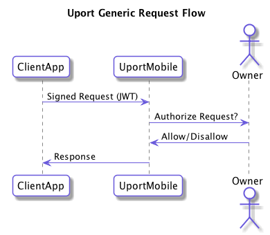

# uPort Specs

uPort is a platform for user centric identity and communication. The platform currently consists of our mobile app, Ethereum smart contracts and number of open protocols for signed messages and message flow.

## Identities

An identity in uPort is really just someone or something that can sign data or transactions and also receive signed data about itself.

An identity has:

- An Identifier in the form of an [MNID](https://github.com/uport-project/mnid)
- A signing key
- A public key stored on the [uPort Registry](https://github.com/uport-project/uport-registry)

An identity can:

- Sign JWTs (JSON Web Tokens)
  - [Authenticate themselves to a third party](messages/shareresp.md)
  - [Disclose private information about themselves](messages/shareresp.md)
- [Receive requests for disclosure about themselves](messages/sharereq.md)
- [Receive and store signed third party verifications about themselves](flows/verification.md)
- [Sign Ethereum transactions](flows/tx.md)

### Identities created using the uPort Mobile App

Currently most uPort users manage their identities through our mobile app. Identities created today consist of an instance of the [Proxy](https://github.com/uport-project/uport-identity/blob/develop/contracts/Proxy.sol) smart contract deployed on a supported Ethereum-compatible blockchain.

## Request Flows

A request will typically be signed by a client app and sent to mobile app using this generic request flow:

We currently support the following flows:

- [Selective Disclosure Flow](flows/selectivedisclosure.md)
- [Send Verification Flow](flows/verification.md)
- [Ethereum Transaction Request Flow](flows/tx.md)
- [Private Chain Provisioning Flow](flows/privatechain.md)

### [More about request flows](flows/index.md)

## Request and Response Transports

There are various ways that requests can be sent to the uPort app and how responses can be returned.

### [Request/Response Transports](transports/index.md)

## Off-chain Messages

Most request and responses are performed privately off-chain between the different parties to a flow.

Most off-chain messages consist of signed JWTs (JSON Web Tokens) as defined in [RFC 7519](https://tools.ietf.org/html/rfc7519). Signatures are verified using our simple uPort PKI (see later in this document).

### [More about Off-chain Messages](messages/index.md)

## On-chain Transactions

The user can sign Ethereum transactions using the mobile app.

### [More about Signing Ethereum transactions](flows/tx.md)

## uPort PKI

uPort implements a simple yet general purpose decentralized PKI system making it easy to create and verify off-chain JWT messages.

### [More about the uPort PKI](pki/index.md)
