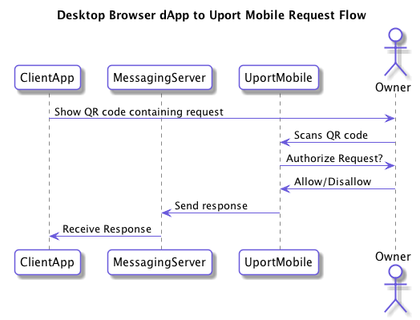

# Uport Request Flows

A request will typically be signed by a client app and sent to mobile app using this generic request flow:

## Specific Application flows

- [Selective Disclosure Flow](./selectivedisclosure.md)
- Send Verification Flow
- Ethereum Transaction Request Flow

## Different Request flows depending on client application type

### Mobile Request Flow

In the case of a mobile app or a web app running in a mobile web browser the request looks like this in more detail:

### Desktop Browser Serverless Flow

For web apps running in a desktop browser with no server backing the flow request flow looks like this:

### Desktop Browser Server Backed Flow

For web apps running in a desktop browser with no server backing the flow request flow looks like this:

