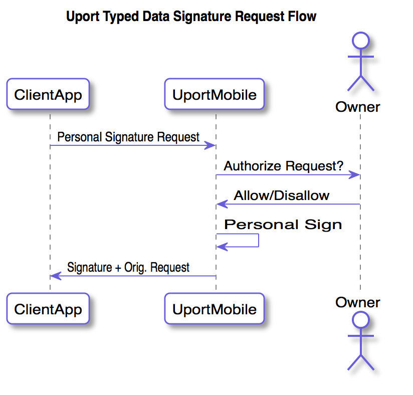

# Personal Signature Request Flow

Similar to a [Typed Data Signature Request](verificationreq.md), a client application can request that the user sign an arbitrary string of data.

The following shows the basic flow:

## Endpoint

The request should be sent to the following URLs:

- `https://id.uport.me/req/[JWT]`

## Send Request

Create a valid signed [Personal Signature Request](../messages/personalsignreq.md).

## Client Callback

The client app MAY include a URL where the response is returned from the user. This can be a HTTPS URL or a custom app URL which receives the response.

Responses are param appended to a URL fragment. If the callback requires the response as a HTTP POST, it is sent as a JSON POST request to the callback URL instead.

### Successful Response

param          | Description
-------------- | -----------
`personalSig` | [Personal Signature Response](../messages/personalsignresp.md)

### Errors

An `error` parameter is returned as the response to the Client App, containing the following:

Error         | Description
------------- | -----------
`access_denied`| User denies the request
