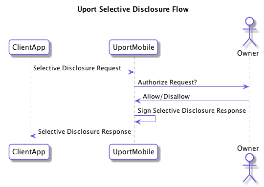

# Selective Disclosure Flow

A client application can request various information from the user.

The following shows the basic flow:

## Endpoint

The request should be sent to the following URLs:

- `https://id.uport.me/req/[JWT]`

*The following endpoints are deprecated*

- `me.uport:me`
- `https://id.uport.me/me`

## Send Request

Create a valid signed [Selective Disclosure Request](/messages/sharereq.md) and send it to the uPort mobile app.

Signed example:

`https://id.uport.me/req/eyJ0eXAiOiJKV1QiLCJhbGciOiJFUzI1NksifQ.eyJp...`

The attributes `redirect_url` and `callback_type` can also be appended to the URL as encoded query parameters to specify how you want the response and control returned. For more details see [Messages](./index.md#json-web-token).

### Deprecated Flows

Create a valid signed or unsigned [Selective Disclosure Request](/messages/sharereq.md) and send it to the uPort mobile app.

Signed example:

`me.uport:me?requestToken=eyJ0eXAiOiJKV1QiLCJhbGciOiJFUzI1NksifQ.eyJp...`

The attributes `redirect_url` and `callback_type` can also be appended to the URL as encoded query parameters to specify how you want the response and control returned. For more details see [Messages](./index.md#json-web-token).

Unsigned example:

`me.uport:me?callback_url=https://mysite.com/callback&label=My%20Site`

## Client Callback

The client app MUST include a URL where the response is returned from the user. This can be a HTTPS URL or a custom app URL which receives the response.

Responses are param appended to a URL fragment. If the callback requires the response as a HTTP POST, it is sent as a JSON POST request to the callback URL instead.

### Successful Response

param          | Description
-------------- | -----------
`access_token` | [Selective Disclosure Response](/messages/shareresp.md)

### Errors

An `error` parameter is returned as the response to the Client App, containing one of following:

Error         | Description
------------- | -----------
access_denied | User denies the request
