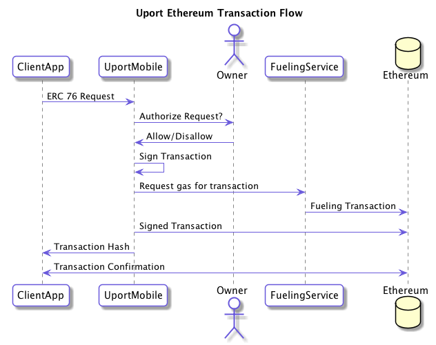

# Ethereum Transaction Flow

A client application can request that a user signs an Ethereum transaction.

The following shows the basic flow:

We currently only support unsigned Ethereum Transaction Requests that are a superset of [ERC 67](https://github.com/ethereum/EIPs/issues/67).

## Endpoint

The request should be sent to one of the following URLs:

- `me.uport:[ADDRESS]`
- `ethereum:[ADDRESS]`
- `https://id.uport.me/[ADDRESS]`

## Addresses

Addresses SHOULD be [MNID](https://github.com/uport-project/mnid) encoded so they have the correct network specified with them.

DEPRECATED: For backwards compatibility any hex address passed along will be interpreted as being on the Ropsten (0x3) network. This will be removed soon.

## ERC 67

To perform an unsigned selective disclosure request append the request parameters as URL encoded query parameters to one of the above endpoints and open it. Eg.:

`me.uport:2oDZvNUgn77w2BKTkd9qKpMeUo8EL94QL5V?transfer(address%200xdeadbeef%2C%20uint%205)&callback_url=https://mysite.com/callback&label=My%20Site`

The following

Name | Description | Required
---- | ----------- | --------
`value` | hex encoded value in wei | yes *
`function` | Solidity function call eg. `transfer(address 0xdeadbeef, uint 5)` | yes *
`bytecode` | Hex encoded data field of transaction | yes *
`callback_url` | The URL that receives the response | no
`callback_type` | Valid values `post` or `redirect`. Determines if callback should be sent as a HTTP POST or open the link (`redirect`). If unspecified the mobile app will attempt to pick the correct one| no
`client_id` | The [MNID](https://github.com/uport-project/mnid) of the requesting identity | no
`label` | Plain text name of client to be displayed to user | no

Either `value`, `function` or `bytecode` is required.

## Client Callback

The client app SHOULD include a URL where the response is returned from the user. This can be a https url or a custom app url which receives the response.

Responses are param appended to a url fragment. If the callback requires the response as a HTTP POST, it is sent as a JSON POST request to the callback url instead.

### Successful Response

param | Description
----- | -----------
`tx`  | Ethereum Transaction Hash

The client app SHOULD verify that the transaction has been successfully included in a block.

### Errors

An `error` parameter is returned as the response to the Client App, containing one of following:

Error         | Description
------------- | -----------
access_denied | User denies the request
processing_error | Something went wrong submitting transaction to the blockchain
