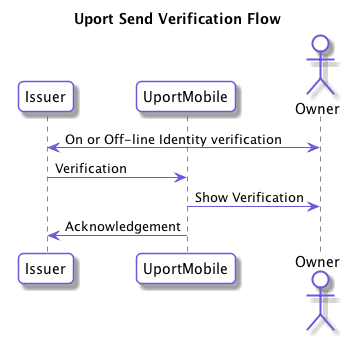
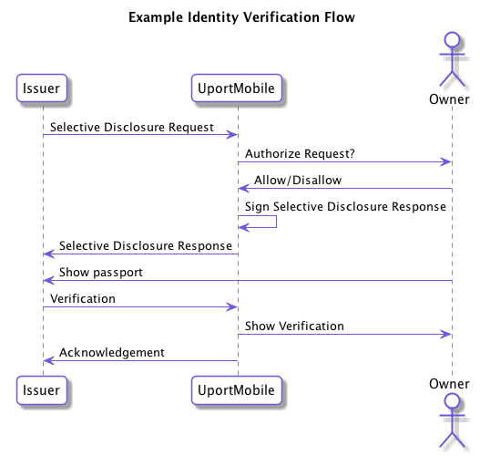

# Send Verification Flow

A client application can verify information about a user

The following shows the basic flow:

A more complete example of using this with a simple Identify Verification service can be seen here. In this case the user starts with a [Selective Disclosure Flow](selectivedisclosure.md) to an issuer. An offline process could be in place where the user now shows their passport to the Issuer after which they will now receive an identity verification in their mobile app.

## Endpoint

The request should be sent to one of the following URLs:

- `me.uport:add`
- `https://id.uport.me/add`

## Send Verifications

Create one or more [Verification's](../messages/verification.md) and send it to the Uport mobile app in the `attestations` query parameter. Multiple verifications can be included by comma separating them.

Example:

`me.uport:add?attestations=eyJ0eXAiOiJKV1QiLCJhbGciOiJFUzI1NksifQ.eyJp...`

## Client Callback

The client app MAY include a URL where the response is returned from the user. This can be a https url or a custom app url which receives the response. The callback is strictly optional and is mainly used if you need to acknowledge in your UX that the attestation has been received.

### Successful Response

param  | Description
------ | -----------
status | always `ok`
