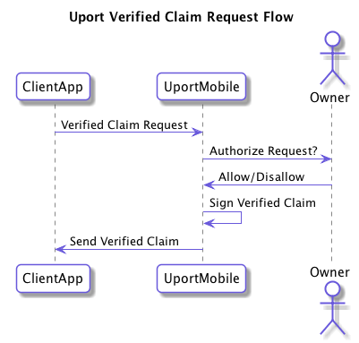

# Verified Claim Request Flow

A client application can request that the user sign a Verified Claim.

The following shows the basic flow:

## Endpoint

The request should be formatted using one of the following URLs:

- `me.uport:me`
- `https://id.uport.me/me`

## Send Request

Create a valid signed [Verified Claim Request](../messages/verificationreq.md) and send it to the uPort mobile app.

Signed example:

`me.uport:req?m=eyJ0eXAiOiJKV1QiLCJhbGciOiJFUzI1NksifQ.eyJp...`

## Client Callback

The client app MUST include a URL where the response is returned from the user. This can be a HTTPS URL or a custom app URL which receives the response.

Responses are param appended to a URL fragment. If the callback requires the response as a HTTP POST, it is sent as a JSON POST request to the callback URL instead.

### Successful Response

param          | Description
-------------- | -----------
`verification` | [Verified Claim](../messages/verification.md)

### Errors

An `error` parameter is returned as the response to the Client App, containing one of following:

Error         | Description
------------- | -----------
access_denied | User denies the request
