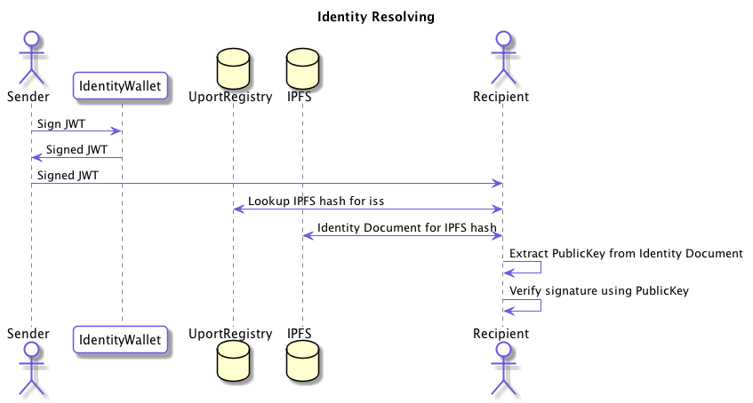
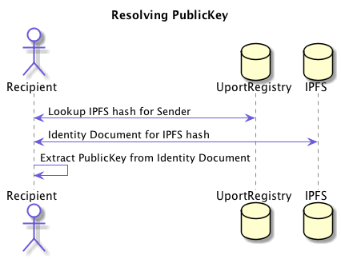
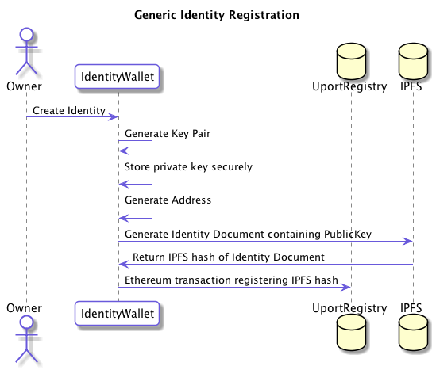
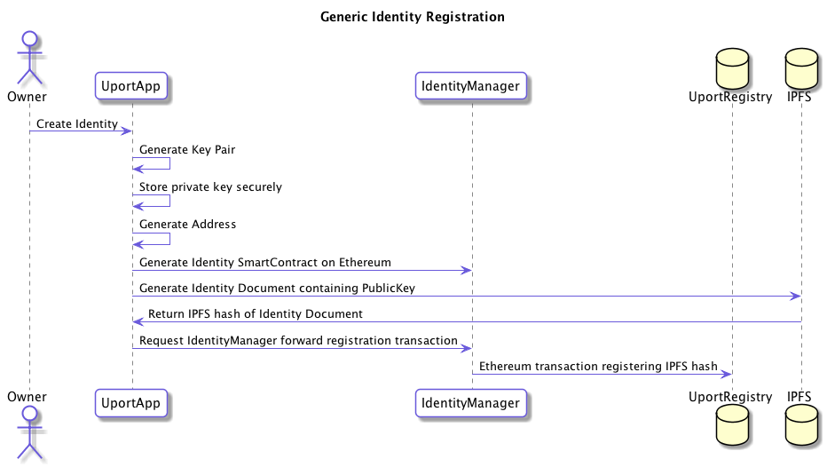

# uPort PKI

uPort implements a simple yet general purpose decentralized PKI system, making it easy to create and verify off-chain JWT messages.

## Purpose

We need a decentralized way to lookup public keys that can be used to verify off-chain JWTs. This allows us to use the power of the Ethereum blockchain to verify signed data privately transferred between parties.

The PKI is not needed for blockchain transactions themselves, as any blockchain already has a PKI-like functionality built in.

We are primarily using it with JWTs, although it could be used for signing other data formats as well.

## Creating and Verifying a JWT

The following overview shows the basic process for creating and verifying a trusted off-chain transaction between two parties using the uPort PKI.



## Identity Document

The Identity Document is a [JSON LD](https://json-ld.org) document stored on IPFS. Here is an example:

[IPFS Hash QmNVHxsMAXvYktfHLYhRjcL7hGBBojTwY7mnJKsJweCZJK]:https://ipfs.infura.io/ipfs/QmNVHxsMAXvYktfHLYhRjcL7hGBBojTwY7mnJKsJweCZJK

```json
{
  "@context":"http://schema.org",
  "@type":"Person","publicKey":"0x04848b547c6effe251b6e9f69c3bc6845b7997963554703aa41bc1b4c8d8db787ac966938139d5b36f404b89727fbc279153a20ad43ff25da0c30edb8b84d9c836",
  "publicEncKey":"bpEGZfAtubOkFSsIdZFSlMN30hYlNOjHzS7LJgep82A="
}
```

Since it is a JSON LD document, you can include all kinds of data (such as name, location, etc.)

### `publicKey` item

The most important part for the function of the PKI itself is that it contains the `publicKey` of the identity. This is the only required item.

This is a `0x` prefixed hex encoded DER encoded public key for the [secp256k1 ECDSA curve](https://en.bitcoin.it/wiki/Secp256k1).

### `publicEncKey` item

This is an encryption public key created for use with [NACL Box Public Key Encryption](http://nacl.cr.yp.to/box.html).

The public encryption key generated by the NACL library is encoded as a Base64 string.

### `name` item

The uPort app and other apps presenting signed JWTs to their users will use the [`name`](http://schema.org/name) item stored in the Identity Document.

### `image` item

The uPort app and other apps presenting signed JWTs to their users will use the [`image`](http://schema.org/image) item stored in the Identity Document.

The image currently has to be stored in IPFS and the format should look like this:

```json
{"image":{"contentUrl":"/ipfs/HASH"}}
```

## Verifying a signature

Any [Signed Message](../messages/index.md) has an `iss` attribute. This contains an [MNID](https://github.com/uport-project/mnid).

An MNID contains an Ethereum address, the network id as well as a checksum.

### Resolving the Public Key for `iss`



1. Decode the MNID of the `iss` and extract the `network` and the `address`
2. In the [uport-registry](https://github.com/uport-project/uport-registry) for the `network` call the function `get("uPortProfileIPFS1220", address, address)` which returns a hash value encoded as 32 bytes
3. Encode the IPFS hash by prepending hex `1220` to the 32 byte hash and encoding it as base58
4. Fetch [JSON Identity Document](./identitydocument.md) from IPFS using IPFS hash
5. Public Key is stored in the `publicKey` key of the Identity Document

### Resolving the Public Encryption Key for `iss`

Done in the same way as above except for the last step:

5. Public Key is stored in the `publicEncKey` key of the [Identity Document](./identitydocument.md)

## Registering an Identity Document

Any address on any supported Ethereum blockchain can register its identity document on the [uport-registry](https://github.com/uport-project/uport-registry).

This shows the basic process:



### External Accounts (Key Pairs)

1. Generate a Key Pair
1. Create a [Identity Document](./identitydocument.md) containing the Public Key
1. Publish Identity Document to IPFS
1. Decode IPFS hash returned to get the raw 32 byte hash value
1. Pick an Ethereum network to register your identity on
1. Generate the Ethereum address for your Key Pair
1. Create a transaction in the [uport-registry](https://github.com/uport-project/uport-registry) for the `network` for the function `set("uPortProfileIPFS1220", address, hash)` signed by your Key Pair

### Smart Contract Accounts

Smart contracts can't sign on their own, so a signing Key Pair will need to be created first.

1. Generate a Key Pair
1. Create an Identity Document containing the Public Key
1. Publish Identity Document to IPFS
1. Decode IPFS hash returned to get the raw 32 byte hash value
1. With your smart contract code create an internal transaction to the [uport-registry](https://github.com/uport-project/uport-registry) on the `network` that your smart contract is deployed to for the function `set("uPortProfileIPFS1220", address, hash)`

Here is an example of how to register an Identity for your smart contract in Solidity:

```js
contract Registry { function set(bytes32 key, address subject, bytes32 value); }

contract MyContract {
    address public owner;
    Registry registry;

    function MyContract(address _registry) {
        owner = msg.sender;
        registry = Registry(_registry);
    }

    function setIdentityDoc(bytes32 hash) {
        // Only allow owner of contract to set the identity document.
        // There could of course be more advanced governance mechanisms here.
        require(msg.sender == owner);

        registry.set("uPortProfileIPFS1220", this, hash);
    }
}
```

### uPort Mobile App Created Identities

Identities created by the uPort Mobile App consist of a simple [Proxy](https://github.com/uport-project/uport-identity/blob/develop/contracts/Proxy.sol) smart contract controlled by a flexible access control smart contract that we call the [IdentityManager](https://github.com/uport-project/uport-identity/blob/develop/contracts/IdentityManager.sol).

This structure allows us to create recoverable identities controlled by multiple devices and even allows us to safely upgrade the complex access control logic.

The way an identity is created in the Mobile App is as follows:



1. Generate a Key Pair on your uPort app
1. Pick an Ethereum network to register your identity on
1. Create an Ethereum transaction registering a [Proxy](https://github.com/uport-project/uport-identity/blob/develop/contracts/Proxy.sol) using the [IdentityManager](https://github.com/uport-project/uport-identity/blob/develop/contracts/IdentityManager.sol)
1. Create an Identity Document containing the Public Key
1. Publish Identity Document to IPFS
1. Decode IPFS hash returned to get the raw 32 byte hash value
1. Create a transaction on the IdentityManager that forwards a transaction to the [uport-registry](https://github.com/uport-project/uport-registry) calling the function `set("uPortProfileIPFS1220", address, hash)` signed by your Key Pair
