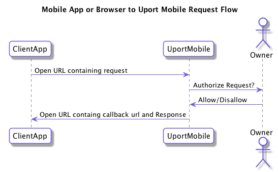
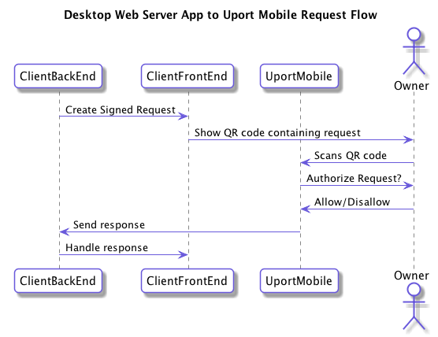
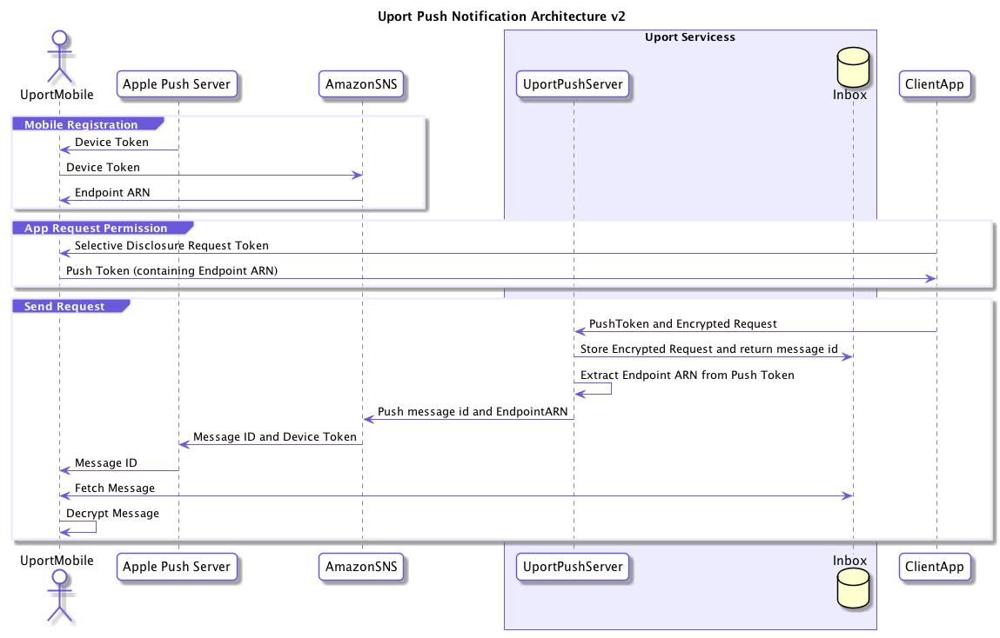

# Request/Response Transports

## Requests

Requests always consist of URLs that are handled by the mobile app. There are different built in ways of sending the URL to the mobile app.

The 3 basic ways of sending a request to the phone are:

- Open uPort URL on the phone
- Scan QR Code
- Send Push Notification

For all of these cases the request consists of a URL.

### Open URL

On the device any URL whose scheme is `me.uport:` or hostname is `id.uport.me` will be opened directly in the uPort app if installed.

The benefit of using `https://id.uport.me` URLs is that they will open a web site with an App Store link if the uPort app is not installed. On a desktop browser, the browser will display a QR code containing the request and will ask the user to scan the code with their mobile app.

The basic purpose of these URLs is to create links in a mobile web app containing requests to the uPort App.

iOS developers can use [`open()`](https://developer.apple.com/documentation/uikit/uiapplication/1648685-open) with the URL directly.

Android developers can use the [`ACTION_VIEW` intent](https://developer.android.com/reference/android/content/Intent.html#ACTION_VIEW) to open the URL as well.

In addition to this basic interaction pattern, URLs starting with `https://id.uport.me` can be sent as tweets, in messages, emails or any other way that you interact with your users.

### QR Code

By encoding the request in a QR code it is very easy for users with the uPort app installed to scan a request. On iOS 11 you can also scan these using the system camera and the app will open.

While this is often used for interacting with an application in a desktop browser, there other applications: QR codes can be printed or displayed at conferences, on posters, or in other real-world use cases.

### Push Notifications

As part of a regular [Selective Disclosure Flow](../flows/selectivedisclosure.md) you can request permissions from your user to send requests directly to their uPort app using push notifications.

Push notifications makes the interaction flow much simpler for users if they have to interact with multiple requests on their phone.

They can also be used to send [Verifications](../flows/verification.md) or [Ethereum Transaction Requests](../flow/tx.md) directly to the user outside of a regular logged in session based on some external event.

For more details see [Push Notification Transport](./push.md)

## Responses

Responses are sent to the callback url included with the Request.

Name | Description | Required
---- | ----------- | --------
`callback_url` | The URL that receives the response | no
`callback_type` | Valid values `post` or `redirect`. Determines if callback should be sent as a

For signed [Selective Disclosure Requests](../messages/sharereq.md) you should include the `callback` attribute in the JWT to ensure that it is not modified by malicious code.

If no callback_url is specified then no response is returned.

If no `callback_type` is specified the mobile app will attempt to pick the correct one:

- If request was received as an Open Link it will default to `redirect`
- If request was either scanned as a QR code or received as a push notification it assumes `post`

### Redirect callback type

In this case the callback url is opened by the uPort mobile app with the response parameters added to the fragment component using the "application/x-www-form-urlencoded" format.

### HTTP post callback type

The response is encoded as JSON and sent as an HTTP POST to the callback url provided.

The callback MUST return 200 to notify the user it has been received correctly.

## Messaging Server

uPort operates a free messaging server at the URL:

`https://chasqui.uport.me`

This allows serverless desktop browser apps to receive a response from the mobile app.

### Preparing callback URL

To use the messaging server, create a large secure URL safe random number that we call the topic id.

Include the callback URL with the following format in your request `https://chasqui.uport.me/api/v1/topic/[TOPIC ID]`.

### Listening for Response

You can perform polling to the same callback URL you passed along to the request using HTTP GET.

#### Endpoint

`GET /api/v1/topic/:id`

#### Response

| Status |     Message    |                               |
|:------:|----------------|-------------------------------|
| 200    | Ok.            | Message stored on topic <id>  |
| 500    | Internal Error | Internal error                |

#### Response data

If no response has been received the `message` object will be empty:

```json
{
  "status": "success",
  "message": {}
}
```

Once the uPort app returns the response it will be included there:

```json
{
  "status": "success",
  "message": {"access_token": "eyJ0eXAiOiJKV1QiLCJhbGciOiJFUzI1NksifQ.eyJp..."}
}
```

### Cleanup

To avoid having potentially private data stored on our server please `DELETE` the response after receiving a successful response.

Just perform a HTTP `DELETE` on the callback url.

#### Endpoint

`DELETE /api/v1/topic/:id`

#### Response

| Status |     Message    |                                            |
|:------:|----------------|--------------------------------------------|
| 200    | Ok.            | Topic deleted                              |
| 404    | Not found      | Topic not found                            |
| 500    | Internal Error | Internal Error                             |

## Examples

### Mobile Browser Transport

In the case of a mobile app or a web app running in a mobile web browser, the request looks like this in more detail:



- Client App opens the request URL directly and app opens
- Response is "redirected" back to client app using the callback URL included. Original app opens and handles response.

### Desktop Browser Serverless Transport

For web apps running in a desktop browser with no server backing it, the request and response transport looks like this:


- The request URL is displayed as a QR code in desktop browser
- User scans QR code using uPort mobile app
- Response is sent back to desktop browser using an external messaging server

### Desktop Browser Server Backed Transport

For web apps running in a desktop browser with an application server, the request and response transport looks like this:



- The request URL is displayed as a QR code in desktop browser
- User scans QR code using uPort mobile app
- Response is sent directly to back end server, which communicates with App front end in desktop browser

### Push Notification Transport

Any of the above transports can be augmented with our Push Notification Transport mechanism. [We have a detailed article explaining how it works](https://medium.com/uport/adventures-in-decentralized-push-notifications-3c64e700ec18).

From a protocol point of view it works like this:



- The user performs a regular [Selective Disclosure Flow](../flows/selectivedisclosure.md) asking for notification permissions using whichever transport they want
- User authorizes the issuance of a "PushToken" to the client app
- Client App receives response containing PushToken
- All future requests are sent to a Push Server maintained by uPort authenticated using the PushToken as a Bearer token see [RFC 6750](https://tools.ietf.org/html/rfc6750)
